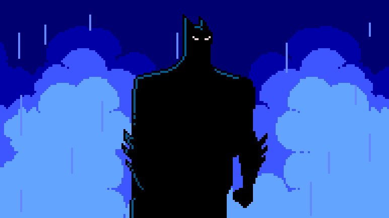

  

<h1 align="center">Hi, I'm Carlos</h1>

  Telecommunications Engineer specialized in Image and Sound  
  Passionate about software, multimedia, VR, and interactive experiences

---

## About me

I am a Telecommunications Engineer specialized in Image and Sound with a strong interest in software development, multimedia systems, and immersive technologies.  
I enjoy creating projects that combine clean development, real-time communication, and interactive digital experiences.  
My goal is to build technology that is both functional and meaningful.

## Links

  
  

## Tech Stack

 `Python` `JavaScript` `Django` `A-Frame` `WebRTC` `HTML` `CSS` `Git` 

<h2 align="left">GitHub Stats</h2>

  

